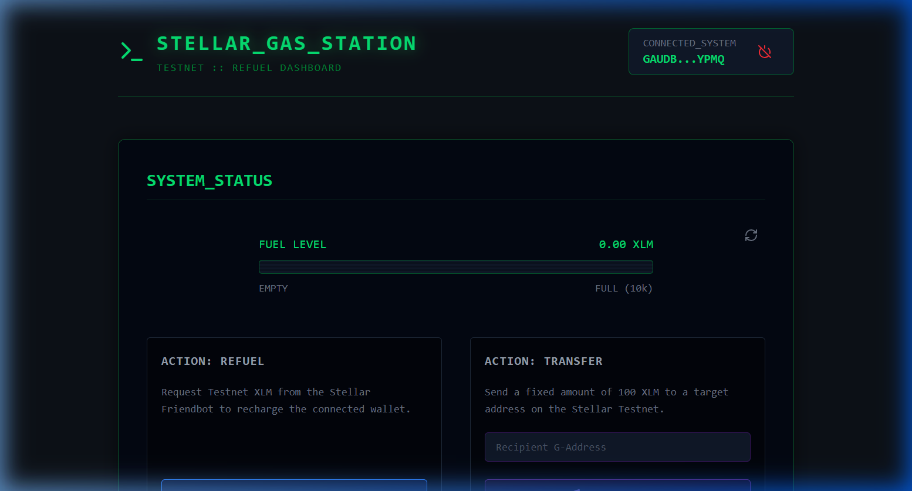
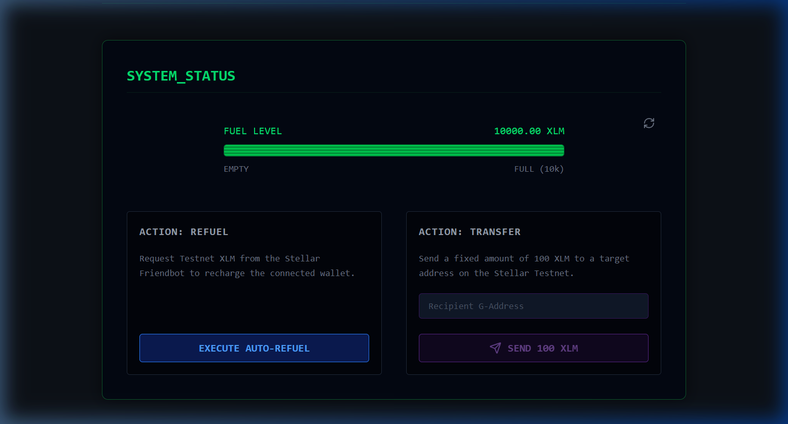
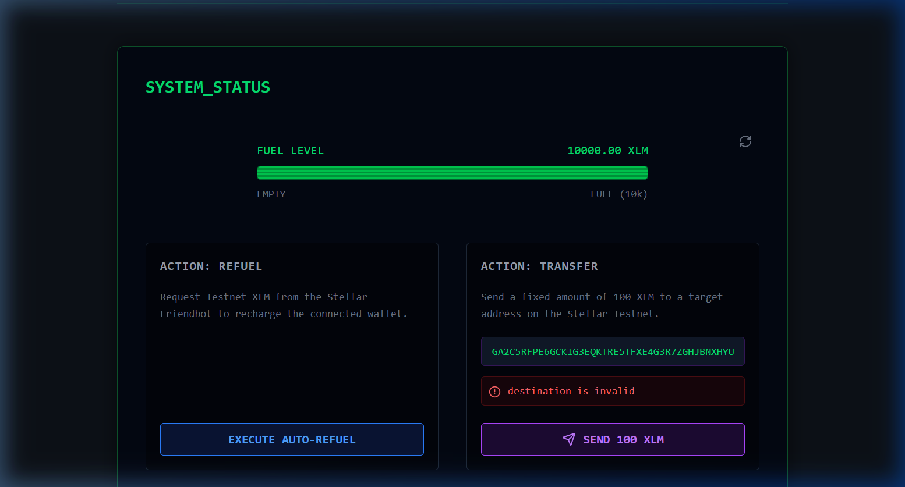
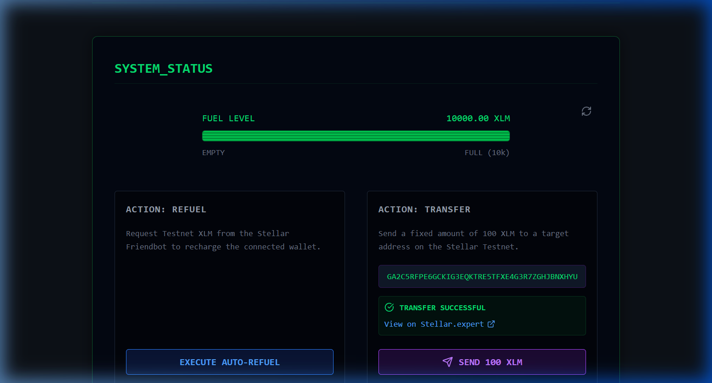

# 🚀 Stellar Gas-Station

A minimalist, high-performance "Refuel" dashboard designed for developers within the Stellar ecosystem. This application allows users to manage their Testnet XLM, request funding via the Official Stellar Friendbot, and perform instant transfers to other valid addresses.

Built as a **White Belt** certification project, this dApp emphasizes clean UI/UX, security through Freighter wallet integration, and real-time on-chain interaction.

---

## 📺 Demo Video
Watch the full automated walkthrough of the application in action, showing the end-to-end flow from connecting the wallet to a successful transaction:


---

## ✨ Features

- **🔐 Secure Wallet Connection**: Quick authentication via the `@stellar/freighter-api`.
- **⛽ Live Balance Monitoring**: Real-time visual tracking of Testnet XLM using a custom CRT-style "Fuel Gauge".
- **💡 One-Click Refuel**: Seamless integration with the Stellar Friendbot for immediate testnet account funding.
- **⚡ Quick Fuel Transfer**: Send exactly 100 XLM to any valid G-address with native signing.
- **🖥️ Cyber-Terminal UI**: A premium, dark-mode terminal aesthetic built for the modern developer.

---

## 🛠️ Tech Stack

- **Frontend**: [React 19](https://reactjs.org/) + [Vite](https://vitejs.dev/)
- **Styling**: [Tailwind CSS v4](https://tailwindcss.com/)
- **Blockchain Interface**: [Stellar SDK](https://github.com/stellar/js-stellar-sdk)
- **Wallet Support**: [Freighter API](https://www.freighter.app/docs)
- **Icons**: [Lucide React](https://lucide.dev/)

---

## 🚀 Getting Started

### Prerequisites

- Node.js (v18+)
- [Freighter Wallet](https://www.freighter.app/) extension installed in your browser.

### Installation

1. Clone the repository:
   ```bash
   git clone https://github.com/ayyush1326-afx/Stellar-gas-station.git
   cd Stellar-gas-station
   ```

2. Install dependencies:
   ```bash
   npm install
   ```

3. Start the development server:
   ```bash
   npm run dev
   ```

4. Open [http://localhost:5173](http://localhost:5173) in your browser.

---

## 📸 Screenshots

### 1. Initial Connection
Once the system is initialized, users can securely connect their Freighter wallet.


### 2. Fuel Level (Balance)
The custom CRT fuel gauge provides immediate visual feedback of your Testnet XLM holdings.


### 3. Transaction Processing
All transfers are signed securely via Freighter and submitted to the Horizon Testnet.


### 4. Successful Transfer
Full transparency with direct links to the transaction on Stellar.expert explorer.


---

## 📜 Workflow

1. **Initialization**: The app checks for Freighter presence and requests account access.
2. **Account Loading**: Fetches the native balance from the Horizon Testnet server.
3. **Refuel**: Sends an authenticated request to Friendbot; updates balance on success.
4. **Transaction**: Constructs a transaction with `TransactionBuilder`, requests a Freighter signature (XDR), and submits to Horizon.

---

## ⚖️ License
Distributed under the MIT License. See `LICENSE` for more information.
