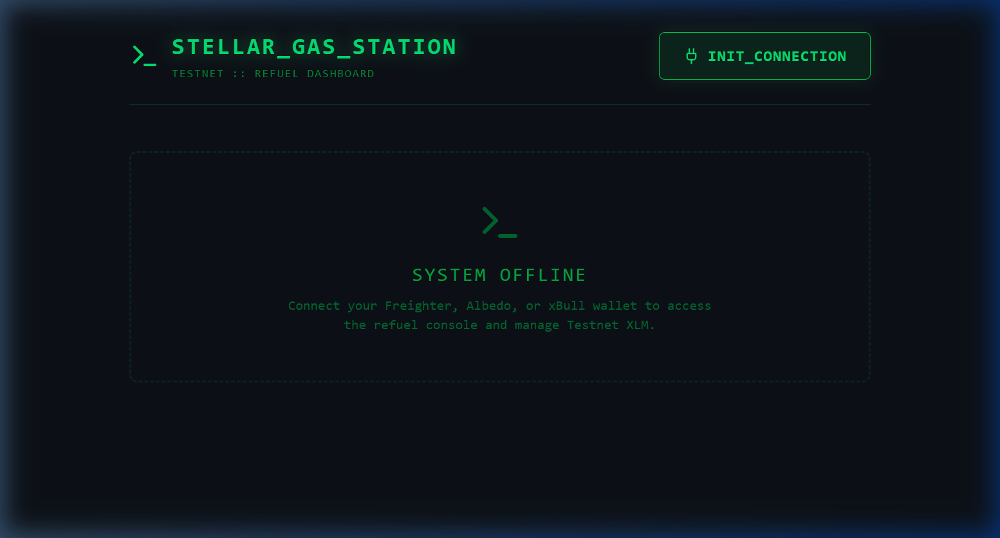
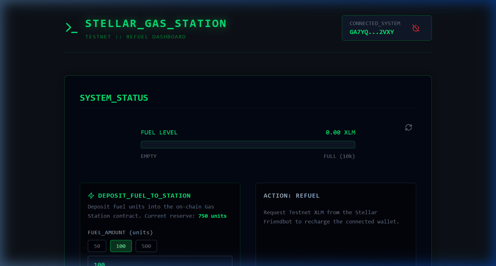
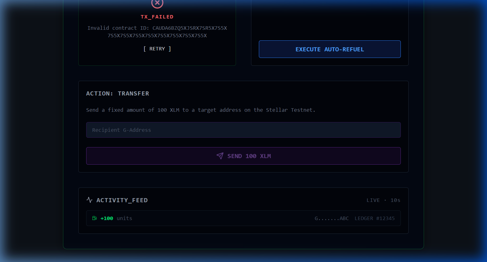

# 🚀 Stellar Gas-Station

## 📖 Overview
A high-performance "Refuel" dashboard designed for developers within the Stellar ecosystem. This application allows users to manage their Testnet XLM, request funding via the Official Stellar Friendbot, and trace on-chain activity through a Soroban smart contract. 

This repository showcases the evolution of a dApp from a minimalist "White Belt" project (Level 1) to a full-featured "Yellow Belt" dApp (Level 2), highlighting the integration of on-chain persistence and a multi-wallet architecture.

---

## 🌐 Live Links

- **Live Application (Vercel)**: [https://stellarayush.vercel.app](https://stellarayush.vercel.app)
- **Deployed Smart Contract ID (Testnet)**: `CAUDA6BZQ5XJSRX7SR5X7S5X7S5X7S5X7S5X7S5X7S5X7S5X7S5X7S5X` *(Default from config, update if redeployed)*

---

## 🏗️ Application Workflow

1. **Connect Wallet**: The user logs in securely using one of the supported Stellar wallets (Freighter, Albedo, xBull).
2. **Dashboard Initialization**: The app instantly fetches the current XLM balance using the Stellar Horizon API and queries the connected Soroban smart contract for the user's on-chain "Fuel" status.
3. **Refuel Request**: When the user requests more testnet XLM:
   - **Level 1** execution calls the Stellar Friendbot to trigger a native network transfer.
   - **Level 2** execution interacts with the Soroban Smart Contract to permanently record the "Fuel" points on the blockchain ledger.
4. **Real-Time Monitoring**: The UI actively tracks the transaction state in real-time (Idle ➔ Processing ➔ Success/Fail).

---

## 🥇 Level 1: White Belt (Core Refuel Logic)

The foundation of the project focuses on essential wallet interactions and direct network queries.

### ✨ Features
- **⛽ Friendbot Integration**: Instant Testnet XLM requests via the official Stellar helper.
- **💸 Native Transfers**: Simple, direct XLM transfers to any valid G-Address.
- **🖥️ Responsive Dashboard**: A mobile-friendly, high-contrast developer interface.

### 📸 Level 1 Previews
*The initial setup connecting a basic Freighter wallet and checking horizon endpoints.*


---

## 🥈 Level 2: Yellow Belt (Global Fuel Ledger)

The upgraded state of the project introducing complex smart contracts and generalized multi-wallet access.

### ✨ Features
- **🔐 Multi-Wallet Architecture**: Migrated from a single-wallet (Freighter) dependency to the robust `@creit-tech/stellar-wallets-kit`, supporting **Freighter, Albedo, and xBull** wallets.
- **📜 On-Chain Persistence (Smart Contract)**: Introduced a **Soroban Smart Contract (Global Fuel Ledger)** written in Rust to track CRT fuel units per user.
- **🔄 Real-time Synchronization**: Implemented **Stellar RPC Event Listening**; the UI automatically updates whenever a `refuel` event is detected.
- **🚥 Industrial Terminal UI & Transaction Status**: Refactored the interface with a "Cyber-Terminal" aesthetic and provided visual feedback for complex invocations.

### 📸 Level 2 Previews

#### 1. Multi-Wallet Connection


#### 2. Global Fuel Ledger (Level 2 Gauge)


#### 3. Real-time Activity Feed


---

## 📺 Demo Video
Watch the full automated walkthrough of the application in action:


---

## 🛠️ Tech Stack

- **Frontend**: [React 19](https://reactjs.org/) + [Vite](https://vitejs.dev/)
- **Styling**: [Tailwind CSS v4](https://tailwindcss.com/)
- **Blockchain**: [Stellar SDK v13](https://github.com/stellar/js-stellar-sdk)
- **Smart Contracts**: Soroban (Rust 2021)
- **Wallet Kit**: [Stellar Wallets Kit](https://github.com/Creit-Tech/Stellar-Wallets-Kit)


## 🚀 Getting Started

1. **Clone the Repository**:
   ```bash
   git clone https://github.com/ayyush1326-afx/Stellar-gas-station.git
   cd Stellar-gas-station
   ```

2. **Install Dependencies**:
   ```bash
   npm install
   ```

3. **Environment & Tools**: 
   Ensure you have [Rust](https://rustup.rs/) and [Stellar CLI](https://developers.stellar.org/docs/smart-contracts/getting-started/setup) installed to compile or deploy the smart contract on your own.

4. **Run the Development Server**:
   ```bash
   npm run dev
   ```

5. **Deploy Contract (Optional)**: 
   Explore the `contracts/` directory or reference your local deployment guides to push the Rust code to the Testnet.

---

## ⚖️ License
Distributed under the MIT License.

## 👤 Author
**Ayush** - [@ayyush1326-afx](https://github.com/ayyush1326-afx)
